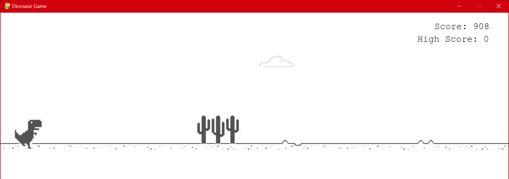
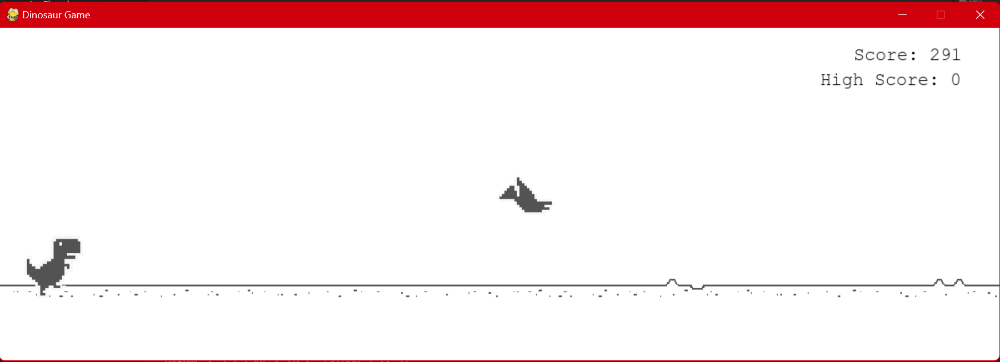
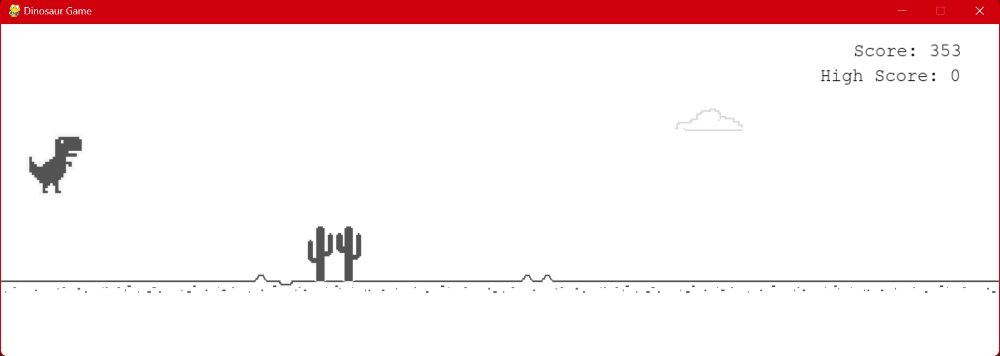

# Dino-Game
This is an implemnetation of the famous Dino Game of Chrome browser in Python using Pygame.

## Requirements
* Python 3.x
* Pygame

## How to run
* Fork the repository and clone it to your local machine using HTTP or SSH links.
```
git clone https://github.com/helios2003/Dino-Game.git
```
* Open the terminal/command prompt from the project directory.
* Run the command `pip install -r requirements.txt` or `pip3 install -r requirements.txt` to install the dependencies.
* Run the command `python main.py`.

## Controls
* Press `Up Arrow Key` to jump.
* Press `Down Arrow Key` to duck.
* Press `Esc Key` to pause the game.

## Note
The project has been built using pygbag library. To build it for yourself and run it in the browser, follow the steps given below:
* Install pygbag using the command `pip install pygbag` or `pip3 install pygbag`.
* In the directory above the project directory run the command ``pygbag <name-of-the-game-directory>``.
* Open the browser and go to the link `http://localhost:8000`.
* Reload the page when the game is over.

## Screenshots
**1. Cactus as Obstacle**



**2. Bird as Obstacle**



**3. Dinosaur Jumping**

